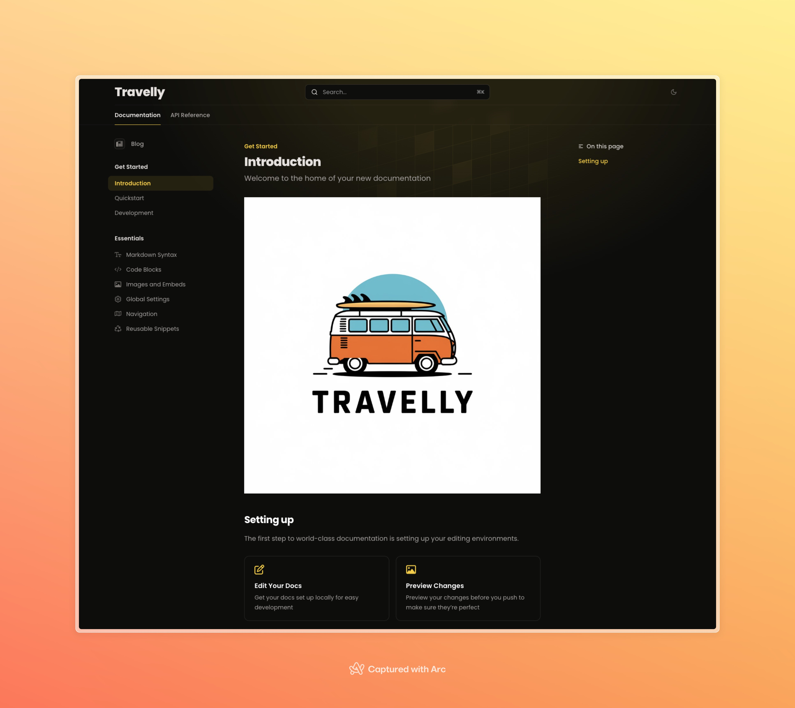

# Travelly: Explore, Dream, Book 🌍


Travelly is a travel application designed to inspire exploration, simplify trip planning, and make booking effortless. Built with modern web technologies, Travelly is your go-to platform for all things travel.

[](https://nextjs.org/)
[](https://vercel.com/)
[](https://turbo.build/)
[](https://tailwindcss.com/)

## 🚀 Features

- **Inspiration**: Discover new destinations and travel ideas
- **Trip Planning**: Easily plan and organize your trips
- **Effortless Booking**: Streamlined booking process for flights, hotels, and activities

## 🛠️ Tech Stack

- ✨ **Frontend**: Next.js
- 🌍 **Deployment**: Vercel
- 🎨 **Styling**: Tailwind CSS
- 🚀 **Monorepo**: Turborepo
- 👨‍🎨 **UI Development**: Storybook (Vite)
- 🍵 **Documentation**: Mintlify
- 🔒 **Authentication**: Clerk

## 🏗️ Project Structure

Travelly is a monorepo managed with Turborepo, consisting of three main applications:

```
.
├── apps/
│   ├── docs/          # Documentation (Mintlify)
│   ├── storybook/     # UI Component development
│   └── web/           # Main Next.js application
├── packages/
│   ├── config/        # Shared configurations
│   ├── database/      # Database schema and utils
│   ├── design-system/ # UI component library
│   └── utils/         # Shared utilities
└── tooling/           # Development tools
```

## 📚 Available Scripts

- `pnpm run dev`: Start all apps in development mode
- `pnpm run build`: Build all apps and packages
- `pnpm run typecheck`: Run typechecking across the entire monorepo
- `pnpm run format`: Format all files using Prettier
- `pnpm run lint`: Lint all files using Eslint
- `pnpm run check-dependencies`: Check for dependency issues
- `pnpm run clean`: Clean up all build artifacts and caches

## 🚦 Getting Started

### Prerequisites

- Node.js (22 or later)
- pnpm (9.15)
- mintlify

### Installation

1. Clone the repository:

   ```bash
   git clone git@github.com:nass59/nextjs-travel.git
   cd nextjs-travel
   ```

2. Install dependencies:

   ```bash
   pnpm install
   ```

3. Set up environment variables:
   ```bash
   cd apps/web
   cp .env.example .env
   ```
   Edit the `.env` file with your specific configuration.

### Development

To run the development server:

```bash
pnpm run dev
```

This will start the Next.js app, Storybook, and the documentation site concurrently.

### Building for Production

To build all apps and packages:

```bash
pnpm run build
```

## 📖 Documentation

To run the documentation:

```bash
cd apps/docs
pnpm run dev
```



## 📝 License

Travelly is licensed under the [MIT License](LICENSE).

## 🙏 Acknowledgements

- [Next.js](https://nextjs.org/)
- [Tailwind CSS](https://tailwindcss.com/)
- [Vercel](https://vercel.com/)
- [Turborepo](https://turbo.build/)
- [Storybook](https://storybook.js.org/)
- [Mintlify](https://mintlify.com/)
- [Clerk](https://clerk.com/)

---

Built with ❤️ by the Travelly Team
